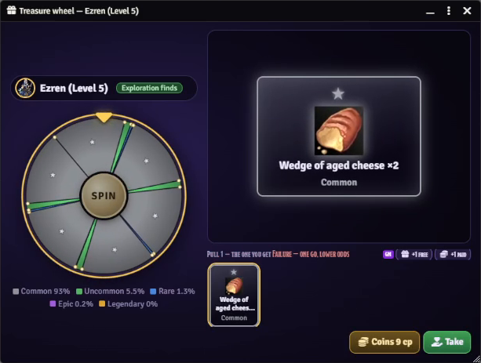
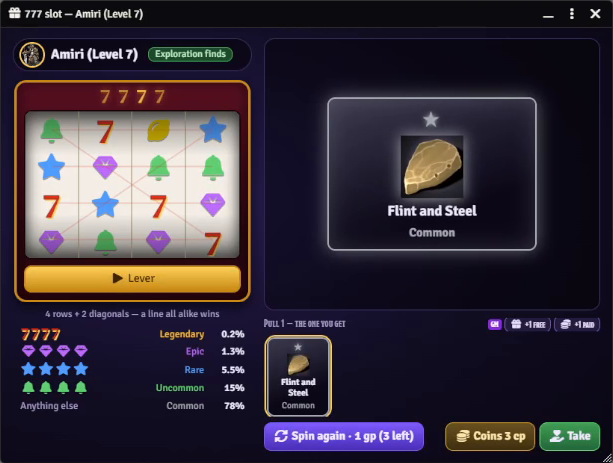
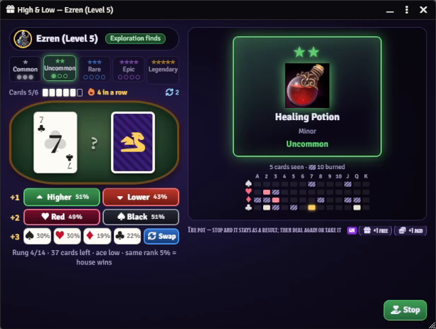

# Rutz's Gacha & Loot

[Discord](https://discord.gg/bB7Ca666Bv) · [Wiki](https://github.com/Rutz179/rutz-pf2e-gacha/wiki) · [한국어](README.ko.md)

A reward machine for **Pathfinder 2e** in Foundry VTT. After Rest for the Night each character can try a check — success opens a treasure wheel of camp finds: mostly food, gear and potions, rarely something special. Pay to spin again, then take the pull or its value in coins — everyone at once, or one at a time while the table watches.



## Features
- **Chance after rest** — PF2e's Rest for the Night posts one card for everyone who rested: each player picks one of the game's checks against a level-based DC. A critical success is a tier up; a failure still gets one go at lower odds.
- **Treasure wheel** — five tiers from common to legendary; re-spins cost coins (scaled to level, up to 3); the last pull is yours, or its value in coins instead.
- **Play together or in turns** — by default each player plays their own chance at once; or one at a time, each spin on every screen with whose turn it is.
- **For GMs** — give a chance any time from the token controls; every option in one **gacha manager** window (odds on one bar with sliders, the games side by side).
- **Hand out loot** — one GM window to deal out items and cash after a fight, with a cash cap per level.
- The **777 slot** (one pull, the reels stop by themselves), **High & Low** (bet on the next card of a real deck), **Kuji** (pick tickets from a board the GM makes), **battle loot** after combat (by the treasure-by-level table), and the items of each tier to edit. Every game shares one reward table; any game can be tuned on its own.

 

## Install
Foundry → *Add-on Modules* → *Install Module* → Manifest URL:
```
https://github.com/Rutz179/rutz-pf2e-gacha/releases/latest/download/module.json
```
Foundry VTT v13–v14 · Pathfinder 2e system · English / 한국어 (follows Foundry's language)

## Quick start
1. Enable the module in a PF2e world.
2. Rest for the Night — a **Search the campsite** card appears in chat. Each player presses **Search**.
3. On a success the wheel opens: **SPIN**, spin again if you like, then **Take**.
4. GM: the 🎁 button in the token controls gives a chance any time.

Full guide: **[Wiki](https://github.com/Rutz179/rutz-pf2e-gacha/wiki)** · Macro: `game.rutzGacha.offer(actors)`

Questions and bug reports: [Issues](https://github.com/Rutz179/rutz-pf2e-gacha/issues) or [Discord](https://discord.gg/bB7Ca666Bv).
